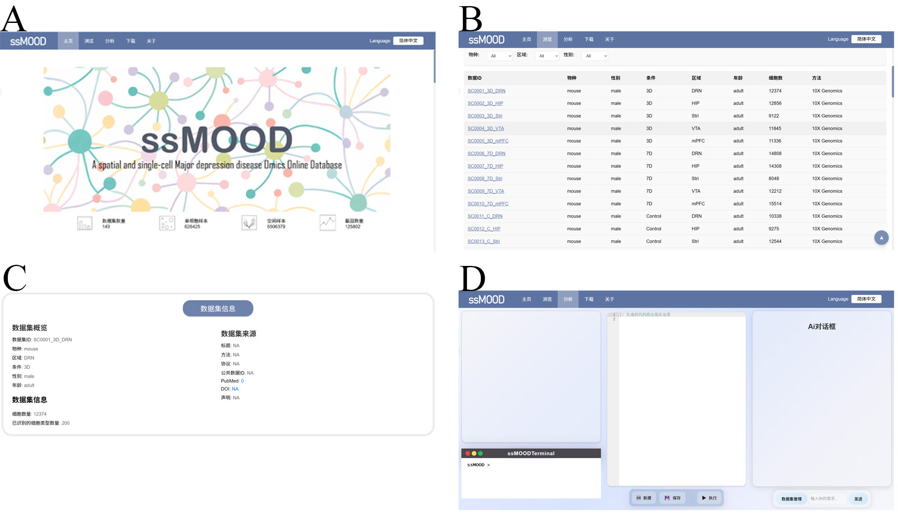
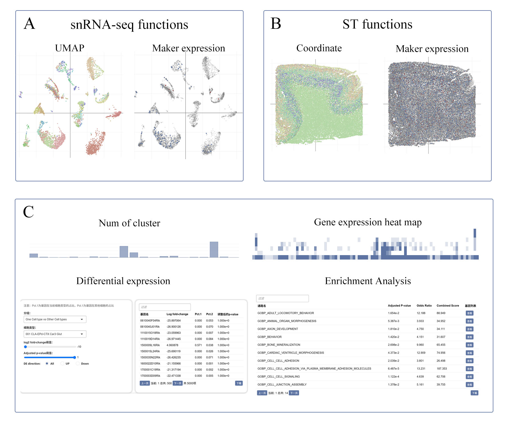
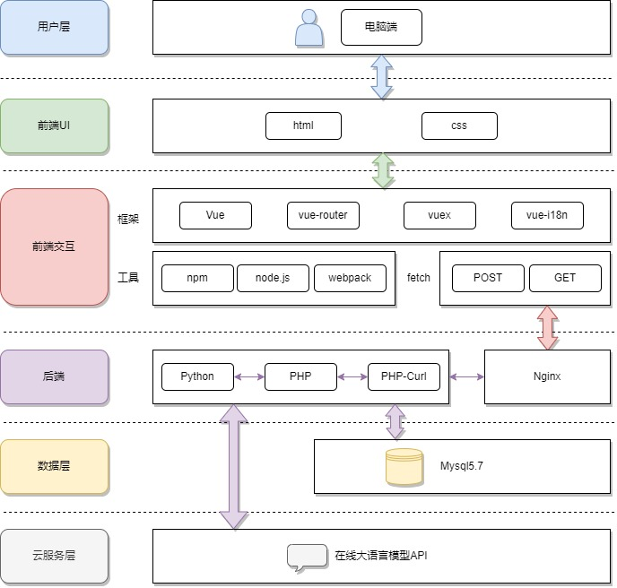

**许可证声明**  
本项目采用 **GNU Affero General Public License v3.0 (AGPLv3)**。  
- ✅ 允许：自由使用、修改、分发  
- 🔄 要求：衍生作品必须开源并保持相同许可证  
- 🌐 网络服务：若提供基于本项目的在线服务，必须公开修改后的源代码

**网络服务特别说明** 

若你将本项目用于提供在线服务（如 Web API、SaaS 平台），必须：
- 向所有用户公开修改后的源代码  
- 在服务显著位置提供源码获取方式（如页面底部链接）

# ssMOOD简介
整合重度抑郁症的空间与单细胞转录组学数据库（spatial and single-cell Major depression disease Omics Online Database，以下简称ssMOOD）是一个涵盖空间与单细胞层面的重度抑郁症（MDD）在线数据库，旨在为科研人员提供全面高效的资源平台，助力深入剖析MDD的分子机制及探寻潜在生物标志物。该数据库整合了人类与CSDS抑郁模型鼠的数据，包含空间转录组学和单细胞核测序（snRNA-seq）的结果。技术架构上，前端采用基于Vue框架的Web界面设计，方便用户查询、可视化与分析；后端依托PHP、Python和MySQL数据库，高效存储与精细化管理超六百万数据。目前，数据库已收录多个研究项目数据，涵盖空间转录组与snRNA-seq两大板块，用户可通过Web界面访问查询并使用内置工具深入研究。

# ssMOOD功能

A-D分别展示了：ssMOOD的首页、数据集列表页面、数据集浏览页面、分析页面。

(A) 部分概述了单细胞核RNA测序（snRNA-seq）页面的功能。利用UMAP技术对细胞聚类结果进行可视化展示，其中不同颜色标识不同的细胞群集。Marker表达图详细描绘了特定标记基因在各细胞群集中的表达模式。(B) 部分则展示了空间转录组（ST）页面的功能概览。这包括三维空间坐标图和Marker表达图，进一步揭示了特定细胞类型在空间中的分布情况。(C) 部分则为单细胞核RNA测序（snRNA-seq）和空间转录组（ST）页面共有的功能，分别展示了：各分类样本数量统计、基因表达热图、差异表达分析结果、富集分析。用户可以在差异表达处按不同的条件筛选结果，然后可以进行基因富集分析。
# ssMOOD构架

# ssMOOD运行环境
操作系统：Ubuntu2020
服务器：Apache2
后端：PHP7.4、Python3.9
数据库：Mysql5.7
