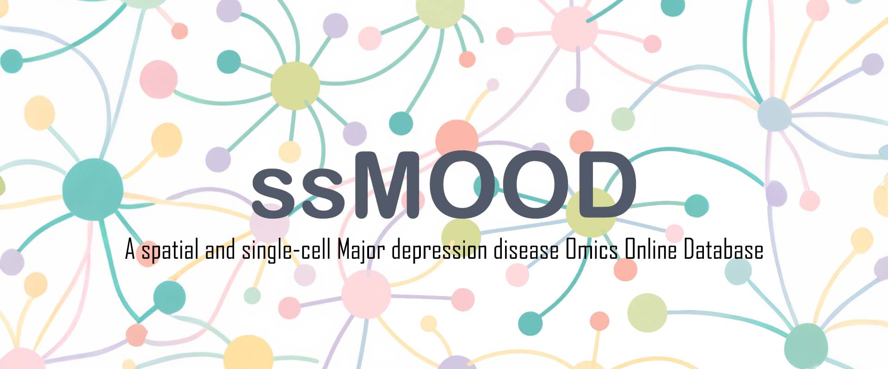
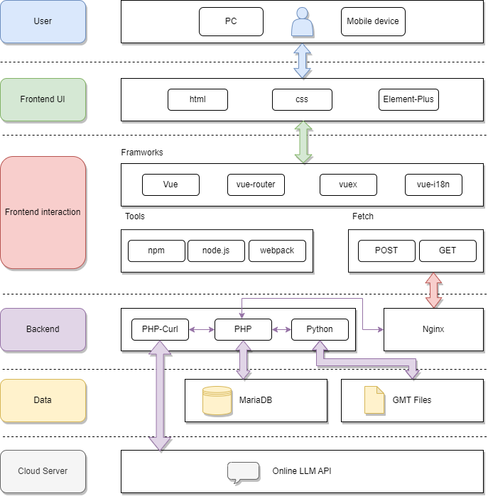

[](https://www.gnu.org/licenses/agpl-3.0)


**License Statement**
This project is licensed under the **GNU Affero General Public License v3.0 (AGPLv3)**.

* ✅ Permitted: free use, modification, and distribution
* 🔄 Requirement: derivative works must remain open source under the same license
* 🌐 Network services: if the project is used to provide online services, the modified source code must be made publicly available

**Special Note on Network Services**

If you use this project to provide online services (e.g., Web API, SaaS platform), you must:

* Make the modified source code publicly available to all users
* Provide a clear and accessible link to the source code in a prominent location (e.g., at the bottom of the service page)


# Introduction to ssMOOD

The **spatial and single-cell Major Depression Disease Omics Online Database (ssMOOD)** is a comprehensive online resource designed to integrate and provide access to spatial transcriptomics and single-cell transcriptomic datasets related to **major depressive disorder (MDD)**. Its primary aim is to facilitate in-depth exploration of the molecular mechanisms underlying MDD and to support the discovery of potential biomarkers for diagnosis and therapeutic development.

ssMOOD brings together data from both human studies and **chronic social defeat stress (CSDS) mouse models**, covering spatial transcriptomics and single-nucleus RNA sequencing (snRNA-seq). Currently, the database contains multiple curated projects, comprising more than **six million entries**, offering researchers a unified platform to query, visualize, and analyze depression-related omics data at both the spatial and single-cell levels.

From a technological perspective, ssMOOD is built upon a **modern, high-performance web architecture**. The frontend is developed with **Vue.js** and **Element Plus**, delivering a responsive and user-friendly interface with interactive visualization capabilities. The backend combines **PHP** and **Python** for efficient data processing and dynamic content generation, while **MariaDB** serves as the core database, providing robust and scalable data storage and management. Together, these technologies enable smooth user interaction, fast query responses, and reliable handling of large-scale omics data.

By integrating state-of-the-art data resources with a modern interface and optimized performance, ssMOOD aims to become a valuable tool for the neuroscience and psychiatry research communities. It empowers users to perform multi-dimensional exploration of MDD-related datasets, bridging spatial and single-cell omics to advance the understanding of this complex psychiatric disorder.


## Overview of ssMOOD Page Functions

### **Home**

The **Home** page provides a comprehensive overview of the database and highlights its core features:

* **Bar Chart of Dataset Counts**: Displays the number of datasets available across different categories, offering a quick snapshot of the data distribution.

* **Species Proportion Pie Chart**: Shows the distribution of species in the database, giving users a clear understanding of the species representation.

* **Single-cell vs ST Proportion**: A comparison chart illustrating the proportion of single-cell data versus spatial transcriptomics (ST) data within the database.

* **UMAP of Human and Mouse Single-cell Data**: Visualizes the clustering of single-cell data for both human and mouse species using UMAP (Uniform Manifold Approximation and Projection).

* **ST Spatial Location Map for Human and Mouse**: Displays the spatial positioning of human and mouse samples within the context of spatial transcriptomics.

* **Integrated Datasets**: Showcases the integration of various datasets, providing a holistic view of the available data across species and techniques.


### **Browse**

The **Browse** section enables users to explore datasets in two primary categories:

* **Single-cell datasets**
  Includes both integrated datasets (aggregated from multiple studies) and individual datasets.As of August 2025, there are 626,425 cells.

* **ST datasets**
  Also includes both integrated and individual datasets, supporting both cross-study comparisons and single-study analyses.As of August 2025, there are 5,506,379 ST datas.

This section is designed to provide intuitive access to raw and processed data, facilitating downstream analyses.


### **About**

The **About** section provides comprehensive background information:

* **Methods**
  Describes the experimental protocols and computational pipelines used for data generation, preprocessing, and integration.

* **Usage**
  Offers guidance on accessing and analyzing datasets, including search, filtering, and visualization features.

* **FAQ**
  Answers to frequently asked questions regarding data interpretation, usage, and troubleshooting.

* **Contact Us**
  Provides contact information for technical support, collaborative inquiries, and data contribution requests.


### **Download**

The **Download** section provides direct access to:

* **Raw datasets**
  Publicly available single-cell and bulk RNA-seq datasets for offline analysis.

* **Source code**
  The complete source code of the web application, enabling reproducibility, local deployment, and further customization.


# ssMOOD Runtime Environment

* **Operating System**: Ubuntu 22.04 LTS
* **Server**: Apache 2
* **Backend**: PHP 8.2, Python 3.10.12
* **Database**: MariaDB 10.6

# ssMOOD project

```
src
├── App.vue                 # Vue root component, entry point and layout container for the entire application
├── assets                  # Static resources folder, such as images, icons, etc.
├── components              # Vue component directory
│   ├── AboutPage.vue       # About page component
│   ├── analyze             # Subcomponents for the analysis pages
│   ├── AnalyzePage.vue     # Main analysis page component
│   ├── backup              # Temporarily deprecated code
│   ├── color_map.js        # Plot color mapping
│   ├── ContactUsPage.vue   # Contact us page component
│   ├── css                 # Styles folder for components
│   ├── DocPage.vue         # Documentation page component
│   ├── DownloadPage.vue    # Download page component
│   ├── general             # General purpose components
│   ├── HomeView.vue        # Homepage component
│   ├── SingleCellList.vue  # Single-cell dataset list page
│   ├── SingleCellPage.vue  # Single-cell dataset detail page
│   ├── ssMOODPageTemplate.vue # Blank page template component
│   ├── STList.vue          # Spatial transcriptomics dataset list page
│   ├── STPage.vue          # Spatial transcriptomics dataset detail page
│   ├── study               # Integrated dataset list
│   ├── studySingleCellPage.vue # Single-cell integrated dataset detail page
│   ├── studySTPage.vue     # Spatial transcriptomics integrated dataset detail page
│   └── VisitLogPage.vue    # User visit log page
├── config                  # Configuration files folder
│   └── index.js            # Global project configuration, such as API endpoints, parameters, etc.
├── locales                 # Localization language files
│   ├── en.json             # English language pack
│   ├── zh-cn.json          # Simplified Chinese language pack
│   └── zh-tw.json          # Traditional Chinese language pack
├── main.js                 # Vue project entry file, mounts root component and routing
├── router                  # Routing configuration files folder
│   └── index.js            # Vue Router configuration file
└── styles                  # Global styles folder
    └── element-theme.css   # Element Plus UI framework theme styles

```

# Project Setup and Usage

## 1. Installation

To get started, you need to install the project dependencies. Follow these steps:

1. Clone the repository to your local machine:

   ```bash
   https://github.com/YuLab-SMU/ssMOOD.git
   ```

2. Navigate to the project directory:

   ```bash
   cd ssMOOD-master
   ```

3. Install the required dependencies using **npm** or **yarn**:

   * Using **npm**:

     ```bash
     npm install
     ```

   * Or using **yarn** (if you have yarn installed):

     ```bash
     yarn install
     ```

This will install all necessary dependencies listed in `package.json`.


## 2. Build

To create a production build of the application, run the following command:

1. **Build the project**:

   * Using **npm**:

     ```bash
     npm run build
     ```

   * Or using **yarn**:

     ```bash
     yarn build
     ```

This will generate optimized and minified files for production in the `dist/` directory.


## 3. Serve

To run the application locally in development mode, follow these steps:

1. **Start the development server**:

   * Using **npm**:

     ```bash
     npm run serve
     ```

   * Or using **yarn**:

     ```bash
     yarn serve
     ```

2. Once the server starts, open your browser and go to the following URL:

   ```bash
   http://localhost:8787
   ```

This will launch the app on the default port **8787**. You can modify the port in the `vue.config.js` file if needed.


### Dependencies and Tools

* **Vue.js**: Frontend framework
* **Element Plus**: UI framework
* **Vue Router**: Routing management
* **npm/yarn**: Package managers

